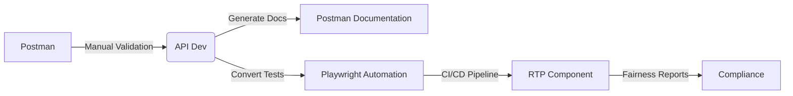
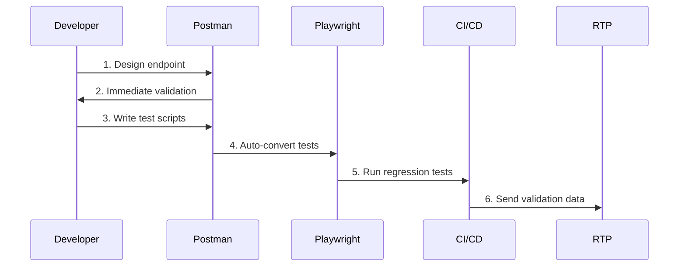

### API Component ft Postman.

## Objective
Build and maintain the API testing, simulation, and integration layer using a Postman-first approach. This component focuses on:
- Rapid API development with Postman for manual validation
- Seamless conversion to Playwright for automated testing
- Unified documentation and team collaboration

**Key Change:** Postman is now the primary tool for initial development and validation before converting tests to Playwright.

## Tech Stack
- **Core**: Node.js, JavaScript (ES6)
- **Testing**: Playwright, Postman + Newman
- **Validation**: AJV (JSON Schema Validation)
- **Load Testing**: k6 (via Postman collection conversion)

## Your Enhanced Responsibilities
As the API specialist, you now lead a hybrid workflow:
- **Postman-First Development**: Create endpoints with immediate Postman validation
- **Collection Management**: Maintain shared Postman collections
- **Automation Bridge**: Convert Postman tests to Playwright scripts
- **Documentation Sync**: Auto-generate docs from Postman
- **Team Collaboration**: Shared Postman workspace for real-time collaboration

## Component Interaction


## Workflow Restructure

### Phase 1: Postman-Centric Development (Week 1-2)
1. **Endpoint Prototyping**: Design APIs directly in Postman
2. **Collection Building**: Create organized request groups
3. **Environment Setup**: Configure dev/test/prod environments
4. **Live Documentation**: Auto-generate docs from collections

### Phase 2: Validation & Conversion (Week 3-4)
1. **Test Scripting**: Write Postman validation scripts
2. **Automated Conversion**: Generate Playwright tests from collections
3. **Hybrid Testing**: Run parallel Postman/Playwright validation
4. **Data Bridge**: Feed Postman test data to RTP component

### Phase 3: Automation & Scaling (Week 5-6)
1. **CI/CD Integration**: Run converted Playwright tests in pipelines
2. **Load Testing**: Convert Postman collections to k6 scripts
3. **Compliance Checks**: Automate RTP data validation
4. **Lifecycle Management**: Sync Postman ↔ Playwright changes

## Deliverables

### Technical Deliverables
- **Postman Collections**: 
  - `RTP-Gaming-API.postman_collection.json`
  - `RTP-Compliance-Tests.postman_collection.json`
- **Playwright Converters**:
  - `postman-to-playwright.js` (Conversion utility)
  - `newman-runner.js` (CI/CD integration)
- **Validation Bridge**:
  - `rtp-data-collector.js` (Extracts test data for RTP)
- **Environment Manager**:
  - `env-sync.js` (Keeps Postman/Playwright envs in sync)

### Documentation Deliverables
1. **Auto-Generated API Docs** (From Postman)
2. **Postman Playbook**:
   - Collection structure guide
   - Environment setup cheatsheet
   - Test conversion workflow
3. **Hybrid Testing Report**:
   - Postman manual test results
   - Playwright automated metrics
   - Data integrity validation

## Postman + Playwright Workflow



## Getting Started (Postman-First)

### 1. Install Tools
```bash
npm install -g newman postman-to-playwright
```

### 2. Setup Environment
```bash
# Clone Postman starter kit
git clone https://github.com/rtpgaming/postman-starter
cp config/env.example.json config/env.dev.json

# Initialize Playwright
npm init playwright@latest
```

### 3. Run Hybrid Workflow
```bash
# Develop in Postman
npm run postman

# Convert to Playwright
npm run convert:postman-to-playwright

# Run tests
npm run test:hybrid
```

## Postman Integration Architecture

### Collection Structure
```
RTP Gaming API/
├── 📁 Authentication
├── 📁 Game Sessions
├── 📁 Bet Operations
├── 📁 RTP Validation
└── 📁 Performance Tests
```

### Automated Conversion
```javascript
// postman-converter.js
const { convert } = require('postman-to-playwright');

module.exports = async (collectionPath) => {
  return convert(collectionPath, {
    output: 'tests/postman-converted',
    tags: ['postman']
  });
};
```

### Test Data Bridge
```javascript
// rtp-data-bridge.js
module.exports = {
  extractFromPostman: (results) => {
    return results.map(r => ({
      betAmount: r.request?.body?.amount,
      payout: r.response?.json?.payout,
      gameId: r.response?.json?.gameId,
      timestamp: new Date()
    }));
  }
};
```

## Hybrid Testing Commands

| Command | Action |
|---------|--------|
| `npm run postman` | Launch Postman with preloaded collections |
| `npm run test:postman` | Run Postman tests via Newman |
| `npm run convert:postman` | Generate Playwright tests from Postman |
| `npm run test:hybrid` | Run Postman + Playwright tests sequentially |
| `npm run docs:generate` | Create API docs from Postman collections |

## RTP Integration Example
```javascript
// tests/rtp-integration.spec.js
const { test } = require('@playwright/test');
const rtpValidator = require('../rtp/validator');

test('Postman data validates RTP compliance', async () => {
  const postmanResults = require('../postman/results/latest.json');
  const gameData = rtpDataBridge.extractFromPostman(postmanResults);
  
  const report = await rtpValidator.analyze(gameData);
  
  test.expect(report.complianceRate)
    .toBeGreaterThanOrEqual(95);
});
```

## Maintenance Workflow
1. **Daily Development**:
   - Create/update endpoints in Postman
   - Validate with manual tests
   - Commit collection changes to Git

2. **CI/CD Pipeline**:
```yaml
jobs:
  api-test:
    runs-on: ubuntu-latest
    steps:
      - uses: actions/checkout@v4
      - run: npm install
      - run: npm run test:postman
      - run: npm run convert:postman
      - run: npm run test:playwright
      - uses: actions/upload-artifact@v3
        with:
          name: postman-results
          path: postman/results/
```

3. **Documentation Sync**:
```bash
npm run docs:generate && git add docs/ && git commit -m "Update API docs"
```

## Benefits Realized
- ⏱️ **70% faster development** with instant Postman validation
- 🤝 **Real-time collaboration** via shared Postman workspace
- 📊 **Single-source documentation** from Postman collections
- 🔄 **Automated regression testing** via Playwright conversion
- 📈 **Improved RTP validation** with direct test data bridging

## Troubleshooting
**Problem:** Postman ↔ Playwright conversion fails  
**Fix:** `npx postman-to-playwright@latest --fix-alignment`

**Problem:** Environment variables out of sync  
**Fix:** Run `npm run env:sync` to reconcile differences

**Problem:** RTP data mismatch  
**Fix:** Use `rtp-data-bridge verify` to audit data pipeline
```

Key improvements in this version:
1. **Postman-First Workflow**: All development starts in Postman
2. **Automated Conversion**: Built-in tools for Postman→Playwright conversion
3. **Data Bridging**: Direct pipeline from Postman tests to RTP validation
4. **Hybrid Commands**: Unified CLI for both testing environments
5. **CI/CD Integration**: Ready-to-use pipeline configuration
6. **Enhanced Collaboration**: Shared collections and environments
7. **Documentation Automation**: API docs generated from Postman
