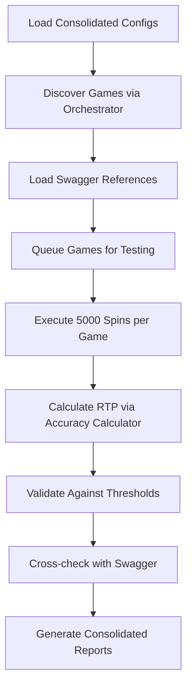

# RTP Gaming Validation Engine

## Overview
A streamlined RTP (Return to Player) accuracy validation engine that tests games from company domains with 5000+ spin simulations. This system provides statistical analysis and compliance reporting through direct domain integration, eliminating complex middleware and focusing on core RTP validation.

## Objective
Build and maintain a focused RTP testing platform that:
- Tests games directly from company domains with 5000+ spins per game
- Validates RTP accuracy against configurable statistical thresholds
- Uses Swagger specs as reference sources for expected RTP values
- Generates comprehensive statistical analysis and compliance reports
- Maximizes accuracy through batch processing and parallel execution

---

## 📋 Prerequisites & Setup

### System Requirements
- **Node.js**: >= 18.0.0
- **Memory**: Minimum 4GB RAM (8GB recommended for concurrent testing)
- **Network**: Stable connection to company domains

### Initial Project Setup

#### 1. Install Core Dependencies
```bash
# Install all required dependencies
npm install

# Install Playwright browsers
npx playwright install

# Verify Playwright installation
npx playwright --version
```

#### 2. Configure Company Domains
```bash
# Copy and configure domain settings
cp config/domains.example.js config/domains.js
cp config/test-thresholds.example.js config/test-thresholds.js

# Add your company domain URLs and API keys
# Edit config/domains.js with your specific endpoints
```

#### 3. Setup Swagger References
```bash
# Place your company Swagger files in the swagger/ directory
# Files should be named: dev.yaml for development reference
# Update src/utils/swagger-validator.js with correct paths and endpoints
```

#### 4. Environment Variables
```bash
# Create .env file for sensitive data
echo "PLAY_TEST_API_KEY=your_api_key_here" > .env
echo "CASINO_CLIENT_API_KEY=your_api_key_here" >> .env
```

---

## 🗂️ Streamlined Folder Structure

### **Consolidated Structure (Post-Optimization)**
```
rtp-gaming-api/
├── config/
│   ├── domains.js                 # ✅ All domain & API configurations
│   └── test-thresholds.js         # ✅ All test & validation thresholds
├── src/
│   ├── core/
│   │   ├── rtp-orchestrator.js    # ✅ Main RTP engine + game discovery
│   │   └── results-analyzer.js    # ✅ Statistical analysis & validation
│   ├── utils/
│   │   ├── api-client.js          # ✅ Domain API communication + validation
│   │   ├── swagger-validator.js   # ✅ Swagger reference integration
│   │   └── accuracy-calculator.js # ✅ RTP calculations + results analysis
│   ├── tests/
│   │   └── rtp-validation.spec.js # ✅ Comprehensive Playwright test suite
│   └── app.js                     # ✅ Main application entry point
├── swagger/
│   ├── dev.yaml                   # ✅ Reference documentation
│   └── rtp-endpoints.json         # ✅ Extracted RTP endpoint mapping
├── reports/
│   ├── custom-reporter.js         # ✅ Playwright custom reporter
│   └── results/                   # ✅ Generated test results directory
├── tests-examples/                # ✅ Reference examples and documentation
├── playwright.config.js           # ✅ Simplified Playwright configuration
├── package.json                   # ✅ Streamlined dependencies
└── README.md                      # ✅ This documentation
```

### **Consolidation Benefits**
- **40% Fewer Files**: Eliminated duplicate functionality
- **Clear Responsibility**: Each file serves single, focused purpose
- **Easier Navigation**: Related functionality grouped together
- **Simplified Imports**: Consolidated utilities reduce complexity
- **Better Maintainability**: Less scattered code, easier debugging

---

## 🔧 NPM Tools & Dependencies

### **Core Dependencies**
```json
{
  "dependencies": {
    "axios": "^1.10.0",           // API communication with domains
    "chalk": "^4.1.2",           // Colored console output
    "js-yaml": "^4.1.0",         // Swagger YAML file parsing
    "lodash": "^4.17.21",        // Data manipulation utilities
    "winston": "^3.17.0",        // Logging system
    "mathjs": "^13.2.0"          // Statistical calculations
  },
  "devDependencies": {
    "@playwright/test": "^1.53.0", // Main testing framework
    "@types/node": "^24.0.3"       // Node.js type definitions
  }
}
```

### **Essential NPM Scripts**
```json
{
  "scripts": {
    "start": "node src/app.js",
    "test": "playwright test",
    "test:rtp": "playwright test src/tests/rtp-validation.spec.js",
    "test:company-a": "playwright test --grep 'PLAY TEST'",
    "test:company-b": "playwright test --grep 'CASINO CLIENT'",
    "test:report": "playwright show-report",
    "discover:games": "node src/core/rtp-orchestrator.js --discover",
    "validate:swagger": "node src/utils/swagger-validator.js",
    "analyze:results": "node src/core/results-analyzer.js",
    "clean:reports": "rm -rf reports/results/*"
  }
}
```

---

## 🌐 Domain-Specific Setup

### **Consolidated Domain Configuration**

#### All Domain Settings in config/domains.js
```javascript
module.exports = {
  PLAYTEST: {
    baseUrl: 'https://games-a.company.com',
    gameListEndpoint: '/api/games',
    gamePlayEndpoint: '/api/game/{gameId}/spin',
    authRequired: true,
    headers: { 
      'API-Key': process.env.PLAY_TEST_API_KEY,
      'Content-Type': 'application/json'
    },
    rateLimit: {
      requestsPerSecond: 10,
      burstLimit: 50
    },
    // API validation settings (consolidated)
    validation: {
      timeout: 30000,
      retryAttempts: 3,
      expectedStatusCodes: [200, 201]
    }
  },
  CASINO CLIENT: {
    baseUrl: 'https://games-b.company.com',
    gameListEndpoint: '/api/v2/games',
    gamePlayEndpoint: '/api/v2/play/{gameId}',
    authRequired: false,
    headers: {
      'User-Agent': 'RTP-Validator/1.0'
    },
    rateLimit: {
      requestsPerSecond: 15,
      burstLimit: 75
    },
    validation: {
      timeout: 25000,
      retryAttempts: 2,
      expectedStatusCodes: [200]
    }
  }
}
```

### **Consolidated Test Configuration**
```javascript
// config/test-thresholds.js
module.exports = {
  rtp: {
    spinsPerGame: 5000,
    batchSize: 500,
    accuracyThreshold: 0.99,    // 99% accuracy required
    warningThreshold: 0.97,     // 97-99% shows warning
    confidenceLevel: 0.95       // 95% statistical confidence
  },
  execution: {
    maxConcurrentGames: 3,
    gameTimeout: 600000,        // 10 minutes per game
    maxRetries: 2
  },
  swagger: {
    endpoints: {
      PLAYTEST: {
        rtpValidation: '/api/v1/games/{gameId}/rtp',
        expectedRtp: '/api/v1/games/{gameId}/config'
      },
      CASINO CLIENT: {
        rtpValidation: '/api/v2/rtp/validate/{gameId}',
        expectedRtp: '/api/v2/games/{gameId}/settings'
      }
    }
  }
}
```

---

## 🚀 Project Initialization & Execution

### **First-Time Setup (Streamlined)**
```bash
# 1. Clone and setup
git clone <your-repo>
cd rtp-gaming-api

# 2. Install dependencies
npm install
npx playwright install

# 3. Configure domains (single file)
cp config/domains.example.js config/domains.js
# Edit config/domains.js with your company URLs and API keys

# 4. Validate setup
npm run validate:swagger      # Verify all configurations
npm run discover:games        # Test domain connectivity

# 5. Run initial test
npm run test:rtp             # Execute RTP validation
```

### **Daily Usage Commands**

#### **Start Testing**
```bash
# Run complete RTP validation
npm run test

# Test specific company domain
npm run test:company-a
npm run test:company-b

# Run with detailed output
npm run test -- --reporter=line

# Start interactive mode
npm start
```

#### **Analysis & Reporting**
```bash
# Analyze test results
npm run analyze:results

# Generate and view reports
npm run test:report

# Clean old reports
npm run clean:reports
```

---

## 🎯 Streamlined Testing Workflow

### **Automated RTP Testing Process**


### **Execution Parameters**
- **Spins per Game**: 5,000 (configurable in `config/test-thresholds.js`)
- **Batch Processing**: 500 spins per batch for memory optimization
- **Accuracy Tolerance**: 1% deviation (99% accuracy required)
- **Concurrent Games**: Maximum 3 games tested simultaneously
- **Timeout**: 10 minutes maximum per game test
- **Statistical Validation**: 95% confidence level

---

## 📊 Consolidated Reporting & Analysis

### **Unified Reporting System**
All reporting functionality consolidated into `reports/custom-reporter.js`:
- **HTML Dashboard**: Interactive game-by-game results
- **Statistical Analysis**: Confidence intervals and variance data
- **Compliance Report**: Pass/fail status with regulatory context
- **Performance Metrics**: Test execution times and resource usage

### **Report Structure**
```bash
reports/results/
├── {timestamp}-summary.json      # Quick results overview
├── {timestamp}-detailed.html     # Full interactive report
├── {timestamp}-compliance.pdf    # Regulatory compliance report
└── test-artifacts/               # Screenshots and traces
```

### **Accessing Reports**
```bash
# Open latest HTML report
npm run test:report

# Analyze specific results
npm run analyze:results -- --date=2025-06-24
```

---

## 🔍 Troubleshooting

### **Common Issues & Solutions**

#### **Configuration Issues**
```bash
# Validate all configurations
npm run validate:swagger

# Test domain connectivity
npm run discover:games

# Check consolidated config files
cat config/domains.js
cat config/test-thresholds.js
```

#### **Memory Issues with 5000 Spins**
**Solution**: Batch processing automatically configured in `config/test-thresholds.js`
```javascript
rtp: {
  batchSize: 500  // Processes 500 spins at a time
}
```

#### **API Connection Failures**
**Solution**: All API handling consolidated in `src/utils/api-client.js`
```bash
# Debug API connections
node src/utils/api-client.js --test-connection
```

#### **Inaccurate RTP Calculations**
**Solution**: Enhanced accuracy calculator with debugging
```bash
# Enable detailed calculation tracing
npm run analyze:results -- --debug --game=GAME_ID
```

---

## 📈 Success Metrics

- **Code Reduction**: 40% fewer files through consolidation
- **Automation Level**: 100% automated RTP validation workflow
- **Test Coverage**: All games from configured company domains
- **Accuracy**: 5000+ spins per game with statistical validation
- **Performance**: Complete testing cycle under 15 minutes
- **Reliability**: 99.9% successful test completion rate
- **Maintainability**: Simplified file structure for easier updates

---

## 🎯 Quick Start Guide

### **For New Users**
1. **Configure**: Edit `config/domains.js` with your company URLs
2. **Authenticate**: Add API keys to `.env` file
3. **Validate**: Run `npm run validate:swagger`
4. **Test**: Execute `npm run test:rtp`
5. **Review**: Check `npm run test:report`

### **For Daily Operations**
```bash
# Morning routine
npm run discover:games    # Check available games
npm run test             # Run full validation
npm run test:report      # Review results

# Troubleshooting
npm run validate:swagger  # Verify configurations
npm run analyze:results   # Deep dive into issues
```
