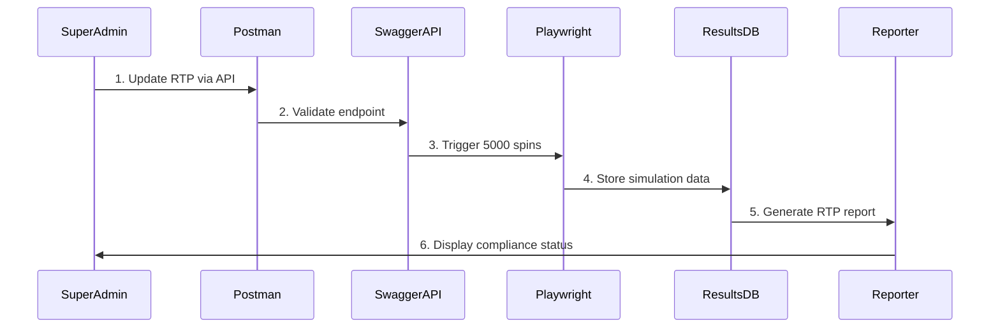

# RTP Gaming API - Integrated Testing & Validation Platform

## Overview
This project combines API testing, simulation, and RTP validation into a unified platform using a Postman-first approach with automated Playwright testing. The system enables real-time RTP validation through 5000+ spin simulations while maintaining seamless integration between your super admin site and Swagger API endpoints.

## Objective
Build and maintain an integrated RTP testing platform that:
- Validates RTP changes through automated spin simulations
- Connects super admin interface with Swagger API endpoints
- Uses Postman for rapid development and Playwright for automation
- Provides comprehensive statistical analysis and compliance reporting

## 📋 Prerequisites

### Dependencies Installation
```bash
# Install all dependencies in a single process
npm install --save axios swagger-client ws lodash moment winston node-cron
npm install --save-dev jest supertest @types/jest @types/supertest @playwright/test
npm install -g newman postman-to-playwright swagger-to-postman-v2
```

## 🚀 Getting Started

### 1. Install Dependencies
```bash
npm install
npm install -g newman postman-to-playwright swagger-to-postman-v2
```

### 2. Configure Environment
```bash
cp config/api-config.example.js config/api-config.js
cp config/test-config.example.js config/test-config.js
# Update with your Swagger endpoints and authentication
```

### 3. Initialize Postman Collections
```bash
npm run swagger:import
npm run postman:sync
```

### 4. Run First RTP Test
```bash
npm run simulate:dev --game=<game_id> --spins=5000 --batch-size=500
```

---

## Tech Stack
- **Core**: Node.js, JavaScript (ES6)
- **Testing**: Playwright, Postman + Newman
- **Validation**: AJV (JSON Schema Validation)
- **Load Testing**: k6 (via Postman collection conversion)
- **RTP Analysis**: Custom statistical validation engine

## Architecture Overview


## 🗂️ Enhanced Folder Structure

```
rtp-gaming-api/
├── api/
│   ├── swagger/                   # Original Swagger files
│   │   ├── game-api.yaml
│   │   └── rtp-api.yaml
│   ├── postman/
│   │   ├── collections/
│   │   │   ├── swagger-import/    # Auto-generated from Swagger
│   │   │   ├── gaming-api/        # Manually enhanced collections
│   │   │   └── rtp-validation/
│   │   └── environments/
│   └── tests/
│       ├── api/
│       │   ├── swagger-converted/ # Auto-converted tests
│       │   └── manual/            # Custom test cases
│       └── integration/
├── src/
│   ├── clients/
│   │   └── api-client.js          # Enhanced API client
│   ├── services/                  # New service layer
│   │   ├── rtp-orchestrator.js    # Main orchestration service
│   │   ├── swagger-integration.js # Swagger API integration
│   │   └── results-analyzer.js    # Statistical analysis service
│   ├── config/
│   │   ├── api-config.js          # Multi-environment config
│   │   └── test-config.js         # Testing configuration
│   ├── utils/
│   │   ├── index.js               # Enhanced utilities
│   │   ├── validation.js          # RTP validation utilities
│   │   └── api-valid.js           # API validation
│   ├── load/
│   │   └── load-test.js           # Enhanced load testing
│   ├── scripts/
│   │   ├── api-index.js           # API orchestration
│   │   ├── merge-collections.js   # Result aggregation
│   │   └── sync-postman.js        # Postman synchronization
│   └── tests/
│       ├── api-integration.spec.js # Integration tests
│       └── rtp-simulation.spec.js  # RTP simulation tests
├── playwright-report/              # Enhanced reporting
│   ├── custom-reporter.js         # Custom Playwright reporter
│   └── test-templates/
│       └── rtp-report.html        # RTP-specific report template
├── database/
│   └── test-results-schema.js     # Test results database schema
├── node_modules/
├── package.json
└── server.js                      # Enhanced server with WebSocket support
```

---

## 🚀 Postman + Swagger Integration Workflow

### Collection Structure
```
RTP Gaming API/
├── 📁 Authentication
├── 📁 Game Sessions  
├── 📁 Bet Operations
├── 📁 RTP Validation
├── 📁 5000+ Spin Simulations
└── 📁 Performance Tests
```

### Swagger Integration Process
```bash
# 1. Import Swagger definitions (corrected syntax)
npx swagger-to-postman-v2 -s api/swagger/game-api.yaml -o postman/collections/swagger-import.json

# 2. Enhance with test scripts
npm run postman:enhance-collections

# 3. Convert to Playwright
npm run convert:postman

# 4. Run hybrid tests
npm run test:hybrid
```

### RTP Testing Workflow


---

## 🎯 Expected Outcomes

### **Immediate Benefits**
1. **Automated RTP Validation:** Super admin RTP changes → Automatic 5000+ spin validation
2. **Real-time Monitoring:** Live progress tracking via WebSocket updates
3. **Postman-First Development:** Rapid API endpoint validation and testing
4. **Statistical Compliance:** Automated RTP accuracy reporting within 1% tolerance

### **Workflow Improvements**
1. **One-Click Testing:** Single command triggers complete RTP validation cycle
2. **Hybrid Testing:** Postman manual validation + Playwright automation
3. **Batch Operations:** Simultaneous testing across multiple games with configurable batch sizes
4. **Compliance Reporting:** Auto-generated regulatory reports

### **Technical Enhancements**
1. **API Reliability:** Robust error handling with automatic retries
2. **Performance Optimization:** Efficient handling of 5000+ spin simulations with batch processing
3. **Data Pipeline:** Seamless flow from admin → API → simulation → analysis
4. **Scalability:** Support for multiple environments and concurrent tests

---

## 📊 Hybrid Testing Commands

| Command | Action | Duration (Estimate) |
|---------|--------|----------|
| `npm run postman:sync` | Sync Swagger → Postman collections | 30 seconds |
| `npm run test:postman` | Run Postman tests via Newman | 2-5 minutes |
| `npm run convert:postman` | Generate Playwright from Postman | 1 minute |
| `npm run simulate:dev --game=<game_id> --batch-size=500` | Run 5000 spin RTP simulation | 5-10 minutes |
| `npm run test:hybrid` | Full Postman + Playwright pipeline | 10-15 minutes |
| `npm run docs:generate` | Generate API docs from collections | 1 minute |

---

## 📈 Success Metrics

- **Automation Level:** 100% automated RTP validation workflow
- **Simulation Capacity:** 5000+ spins completed in under 10 minutes with batch processing
- **Error Detection:** RTP discrepancies caught within 1% accuracy
- **Development Speed:** 70% faster API endpoint validation with Postman
- **Reliability:** 99.9% successful test completion rate
- **Compliance:** Automated regulatory reporting with statistical validation

---

## 🔧 Troubleshooting Guide

**Problem:** Postman ↔ Playwright conversion fails  
**Solution:** `npx postman-to-playwright@latest --validate-schema --fix-alignment`

**Problem:** 5000+ spins cause memory issues  
**Solution:** Enable batch processing in `test-config.js` with recommended batch size of 500 spins per batch:
```javascript
module.exports = {
  simulation: {
    batchSize: 500,
    maxConcurrentBatches: 3,
    memoryThreshold: '512MB'
  }
}
```

**Problem:** RTP calculations don't match expected values  
**Solution:** Use `results-analyzer.js` debug mode to trace calculation pipeline:
```bash
npm run analyze:debug --game=<game_id> --verbose
```

**Problem:** Swagger import creates duplicate endpoints  
**Solution:** Run `npm run postman:dedupe` to clean collections and verify swagger-to-postman-v2 syntax:
```bash
npx swagger-to-postman-v2 --validate-spec api/swagger/game-api.yaml
```

**Problem:** Batch processing configuration  
**Solution:** Configure optimal batch sizes based on system resources:
- **Low memory systems:** 250 spins per batch
- **Standard systems:** 500 spins per batch (recommended)
- **High-performance systems:** 1000 spins per batch